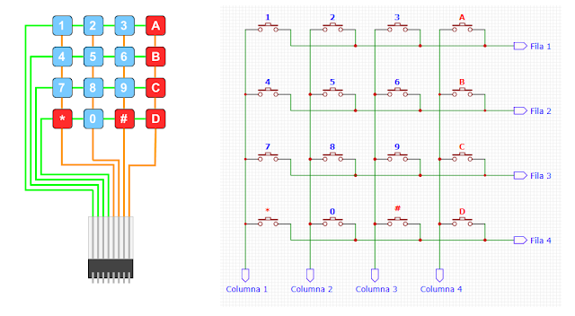

```c 
// Definir los pines de las filas y columnas
byte rowPins[ROWS] = {2, 3, 4, 5};   // (salidas)
byte colPins[COLS] = {6, 7, 8, 9}; // (entradas con pull-up)
```

## 🛠️ Funcionalidad
- Lectura de teclas presionadas
- Salida por Serial Monitor

## ⚙️ Configuración
1. Conectar el teclado según el diagrama
2. Subir el sketch al Arduino Mega
3. Abrir el Serial Monitor (115200 baudios)

## 📝 Uso
Presione cualquier tecla en el teclado matricial y verá el carácter correspondiente en el Serial Monitor.

## 🤝 Contribuciones
Las contribuciones son bienvenidas. Por favor abra un Issue o Pull Request.

## 📄 Licencia
MIT License - Ver archivo LICENSE para detalles